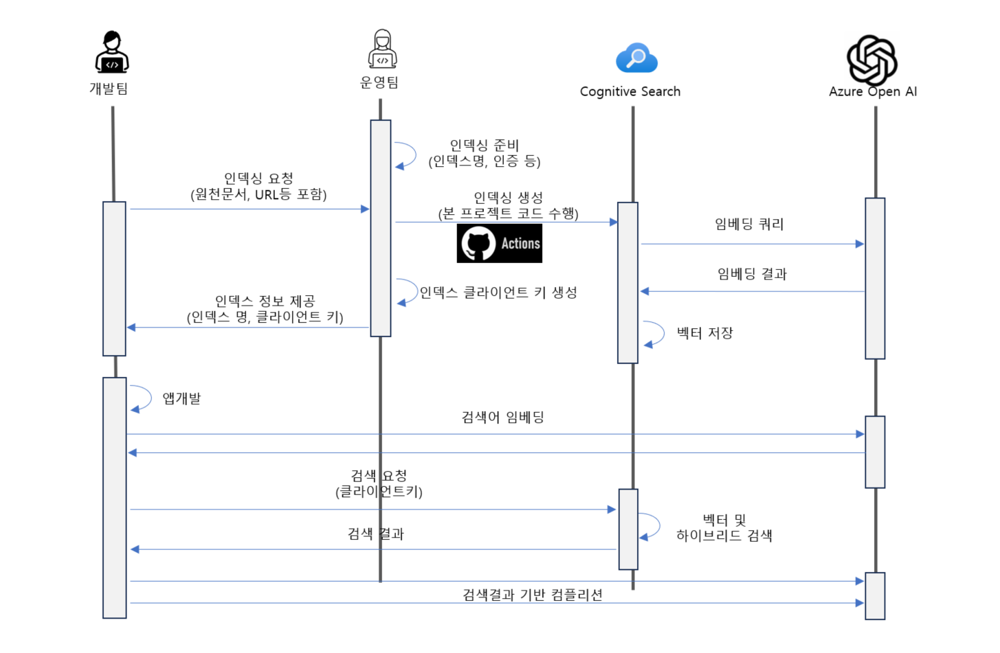

# Simple RAG shell

Azure OpenAI RAG(Retrieval Augmented Generation) 인덱싱을 위한 쉘 스크립트입니다.
Azure Cognitive Search를 이용하여 RAG 인덱싱을 수행하며 Semantic Search와 Vector Search를 동시에 지원하는 인덱스를 생성합니다.

## 사용시나리오



> 개발팀에 전달할 클라이언트 키는 Query Key를 생성하여 전달합니다.
> https://learn.microsoft.com/ko-kr/azure/search/search-security-api-keys?tabs=portal-use%2Cportal-find%2Cportal-query#create-query-keys

> 인덱싱 요청 및 생성은 Azure DevOps Pipeline이나 GitHub Action을 이용하여 자동화할 수 있습니다

## Quick Start

1. 환경 변수 설정

    ```bash
    export AZURE_OPENAI_API_KEY=<Azure OpenAI API Key>
    export AZURE_OPENAI_GPT_DEPLOYMENT=<Azure OpenAI GPT Deployment Name>
    export AZURE_OPENAI_CHATGPT_DEPLOYMENT=<Azure OpenAI Chat GPT Deployment Name>
    export AZURE_OPENAI_EMB_DEPLOYMENT=<Azure OpenAI Embedding Deployment Name>
    export AZURE_OPENAI_SERVICE=<Azure OpenAI Service Name>
    export AZURE_SEARCH_INDEX=<Azure Search Index Name>
    export AZURE_SEARCH_SERVICE_KEY=<Azure Search Service Admin Key>
    export AZURE_SEARCH_SERVICE=<Azure Search Service Name>
    export AZURE_TENANT_ID=<Azure Tenant ID>

    ```

2. 패키지 설치

    ```bash
    python3 -m pip install -r requirements.txt
    ```

    > 필요 시 virtualenv를 사용하여 패키지를 설치합니다.


3. 문서 인덱싱

    ```bash
    ./prepdocs.sh
    ```

## PDF문서 인식 강화 및 문서 링크 연결을 위한 문서 업로드

Azure Form Recognizer를 사용하여 이미지화된 PDF문서 인식을 강화하고 인덱싱 된 문서를 페이지별로 분리하여 Azure Storage Account에 업로드하여 문서의 출처 링크생성을 앱에서 구현할 수 있게 합니다.

* PDF문서를 Azure Form Recognizer사용 시 아래 환경변수를 추가로 설정합니다.

    ```bash
    export AZURE_FORMRECOGNIZER_SERVICE=<Azure Form Recognizer Service Name>
    export AZURE_FORMRECOGNIZER_KEY=<Azure Form Recognizer Service Key>
    ```
   
* 문서를 페이지 별로 분리하여 Azure Storage Account에 업로드 할 때 아래 환경변수를 추가로 설정합니다.

    ```bash
    export AZURE_STORAGE_ACCOUNT=<Azure Storage Account Name>
    export AZURE_STORAGE_CONTAINER=<Container Name>
    export AZURE_STORAGE_ACCOUNT_KEY=<Azure Storage Account Key>
    ```
    
* `prepdocs.sh`에서 Form Recognizer와 Storage Account를 사용하도록 파라미터를 조정합니다. (`predocs-advanced.sh`)

    ```bash
    python3 ./prepdocs.py './data/*' \
        --tenantid "$AZURE_TENANT_ID" \
        --searchservice "$AZURE_SEARCH_SERVICE" \
        --searchkey "$AZURE_SEARCH_SERVICE_KEY" \
        --index "$AZURE_SEARCH_INDEX" \  
        --openaiservice "$AZURE_OPENAI_SERVICE" \
        --openaideployment "$AZURE_OPENAI_EMB_DEPLOYMENT" \
        --openaikey "$AZURE_OPENAI_API_KEY" \        
        --storageaccount "$AZURE_STORAGE_ACCOUNT" \
        --container "$AZURE_STORAGE_CONTAINER" \
        --storagekey "$AZURE_STORAGE_ACCOUNT_KEY" \
        --formrecognizerservice "$AZURE_FORMRECOGNIZER_SERVICE" \
        --formrecognizerkey "$AZURE_FORMRECOGNIZER_KEY" \ 
        -v
    ```

## 노트북을 이용하여 인덱싱 된 결과 확인

* `env.sample`파일에 있는 환경 변수를 설정하고 파일 이름을 `.env`로 변경합니다.

    ```bash
    cp env.sample .env
    ```

* `search-vector.ipynb`있는 노트북을 사용하여 인덱싱 된 결과를 확인할 수 있습니다.

    ```bash
    jupyter notebook
    ```
* Vector 유사성 검색과 Semantic Search를 동시에 활용하는 Hybrid Search를 이용하여 검색 기능을 강화할 수 있습니다.

    ```python
    ...
    r = search_client.search(search, 
                            filter=filter,
                            query_type=QueryType.SEMANTIC,  # Sementic Search 부문
                            query_language="en-us", 
                            query_speller="lexicon", 
                            semantic_configuration_name="default", 
                            top=3,
                            vector=Vector(value=query_vector, k=50, fields="embedding") if query_vector else None) # Vector Search 부문
    ```

* Vector 유사성 검색만을 사용할 수도 있습니다.

    ```python
    ...
    r = search_client.search(search, top=3, vector=Vector(value=query_vector, k=50, fields="embedding") if query_vector else None)
    
    ```

## 참고

https://learn.microsoft.com/ko-kr/azure/search/vector-search-overview#what-scenarios-can-vector-search-support

대안 기능: https://github.com/openai/chatgpt-retrieval-plugin/blob/main/README.md#azure-cognitive-search